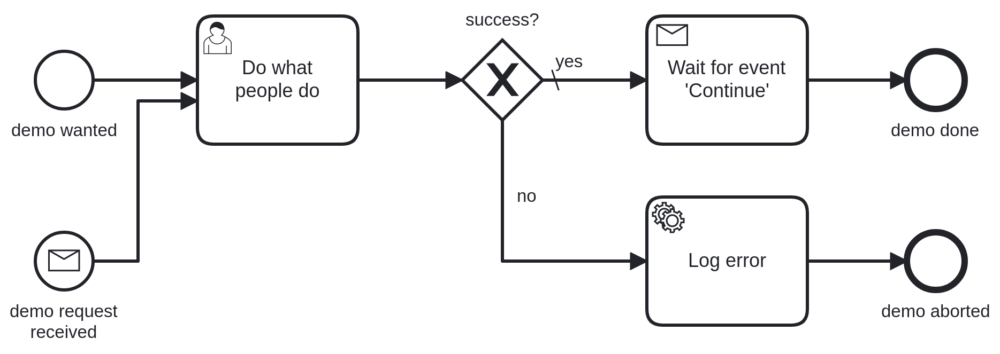

# Demo

This demo was developed as support of the talk "Gain more freedom when migrating from Camunda Platform 7 to 8". This talk is about introducing [VanillaBP](https://www.vanillabp.io) which is an independent API for business processing engines. Additionally, it shows how migrations from Camunda Platform 7 to Camunda Platform 8 work without changing the code.

The process is quite simple and covers only a couple but representative situations one will face developing business processing applications:



If you are interested in a more elaborated example then checkout the [Taxi Ride Blueprint](https://github.com/phactum/taxiride-blueprint).

## Scenarios

### Using Camunda Platform 7

To run the demo using Camunda Platform 7 use these commands:

```sh
mvn clean package -Pcamunda7
java -Dspring.profiles.active=camunda7 -jar target/demo-0.0.1-SNAPSHOT.jar
```

### Using Camunda Platform 8

To run the demo using Camunda Platform 8 you have to [start Zeebe first e.g. by using docker-compose](https://github.com/camunda/camunda-platform).

Afterwards use these commands:

```sh
mvn clean package -Pcamunda8
java -Dspring.profiles.active=camunda8 -jar target/demo-0.0.1-SNAPSHOT.jar
```

### Migrating from Camunda Platform 7 to Camunda Platform 8

To test migration scenarios you have to [start Zeebe first e.g. by using docker-compose](https://github.com/camunda/camunda-platform).

Afterwards use these commands:

```sh
mvn clean package -Pcamunda8,camunda7
java -Dvanillabp.default-adapter=XXXX -Dspring.profiles.active=camunda8,camunda7 -jar target/demo-0.0.1-SNAPSHOT.jar
```

The placeholder `XXXX` for the default-adapter has to be set according to the phase of migration:

1. `camunda7,camunda8`: Prepare migration
1. `camunda8,camunda7`: In migration

To test migration scenarios follow the instructions in section [Usage](#usage).

For more details see [documentation about migration](https://github.com/vanillabp/spring-boot-support#migrating-from-one-bpm-system-to-another).

## Usage

The demo exposes a REST-API:

* *Start the workflow:* e.g. [http://localhost:8080/api/demo/4](http://localhost:8080/api/demo/4)
* *Start a workflow by event:* e.g. [http://localhost:8080/api/request-demo/2](http://localhost:8080/api/request-demo/2)
* *Complete the user-task:* e.g. [http://localhost:8080/api/demo/4/process-task-completed/f140066a-b7fc-11ed-8a10-9664cca3abf1](http://localhost:8080/api/demo/4/process-task-completed/f140066a-b7fc-11ed-8a10-9664cca3abf1) (the task id can be found in the application log)
* *Trigger event 'Continue':* e.g. [http://localhost:8080/api/continue-demo/4](http://localhost:8080/api/continue-demo/4)

The given ID (in these samples `4` or `2`) is used to determine the `success` attribute used by the process: Even numbers are treated as `successful` and odd number as `not successful`.

### Testing migration

Precondition: The demo application is built as shown in [Scenarios](#migrating-from-camunda-platform-7-to-camunda-platform-8) section.

1. *Phase of preparation:* 
    1. Start the demo application using Spring Boot property `-Dvanillabp.default-adapter=camunda7,camunda8` which makes VanillaBP aware of both targets, but workflows are still started using Camunda Platform 7.
    1. Start a workflow.
    1. Start a second workflow by triggering an event.
    1. Check [cockpit](http://localhost:8080/camunda/app/) for current status (use credentials `admin/admin`).
    1. Complete the user-task of one workflow to run into the receive-task. Trigger the event to proof workflow completes as expected.
1. *Phase of migration:*
    1. Restart the demo application using Spring Boot property `-Dvanillabp.default-adapter=camunda8,camunda7` forcing new workflows to be started using Camunda Platform 8 but still support those started using Camunda Platform 7.
    1. Start a workflow.
    1. Start a second workflow by triggering an event.
    1. Check [operate](http://localhost:8081) for current status (use credentials `demo/demo`).
    1. Complete user task of old C7 workflow, makes it run into the receive task.
    1. Trigger the event to complete the receive task.
    1. Complete user task of new C8 workflow, makes it run into the receive task.
    1. Trigger the event to complete the receive task.
    
As you can see VanillaBP chooses the right adapter for each workflow. For more details see [documentation about migration](https://github.com/vanillabp/spring-boot-support#migrating-from-one-bpm-system-to-another). 

## Noteworthy & Contributors

VanillaBP was developed by [Phactum](https://www.phactum.at) with the intention of giving back to the community as it has benefited the community in the past.


## License

Copyright 2022 Phactum Softwareentwicklung GmbH

Licensed under the Apache License, Version 2.0
